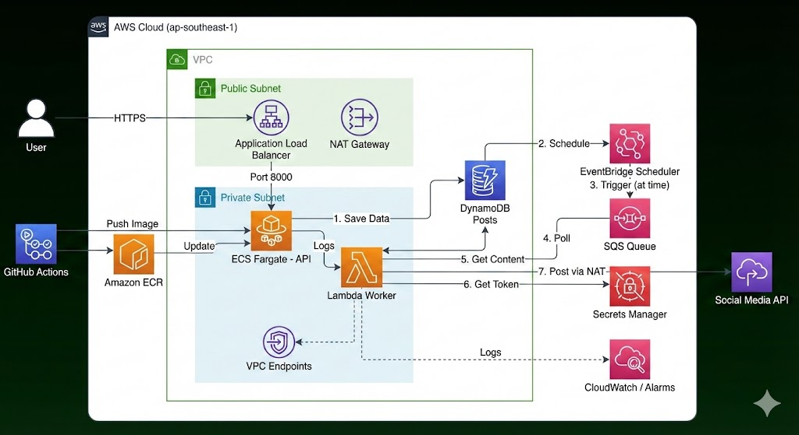

# Đề bài
[Đề bài 13: Dịch vụ Lên lịch Đăng bài Mạng xã hội](https://docs.google.com/document/d/1Slv-_sBmwI-i_RHg9si-eywNaMgMku9Cw6iT10O1tWo/edit?tab=t.0)

**Ý tưởng:** Một ứng dụng SaaS cho phép người dùng kết nối các tài khoản mạng xã hội và lên lịch đăng bài trong tương lai.

**Yêu cầu Hệ thống & Chức năng:**

- **Thành phần chính:** ECS Fargate (cho API), EventBridge Scheduler, SQS, Lambda.
- **Luồng dữ liệu:** Người dùng gọi API (trên ECS) để tạo lịch. API sẽ tạo một lịch trình trên EventBridge Scheduler. Khi đến giờ, EventBridge sẽ gửi message vào SQS. Một hàm Lambda sẽ đọc từ SQS và thực hiện việc đăng bài.
- **Tính năng:** Lên lịch, sửa, xóa bài đăng.

**Yêu cầu Vận hành & Mở rộng:**

- Các token truy cập mạng xã hội phải được mã hóa và lưu trữ an toàn trong Secrets Manager.
- Giám sát số lượng lịch trình đang hoạt động và tỷ lệ đăng bài thành công/thất bại.

# 🚀 Social Media Scheduler (DevOps Mock Project)
Dịch vụ SaaS cho phép người dùng lên lịch đăng bài lên mạng xã hội trong tương lai. Hệ thống được thiết kế theo kiến trúc **Event-Driven**, đảm bảo khả năng mở rộng (Scalability) và bảo mật (Security First).

## 🏗 Kiến trúc Hệ thống


## 💡 Các quyết định thiết kế (Design Decisions)
**1. Compute: Hybrid Approach**
- **ECS Fargate (API):** Dùng cho API Server vì cần chạy liên tục (Long-running), thời gian khởi động nhanh và dễ dàng mở rộng.
- **AWS Lambda (Worker):** Dùng cho tác vụ xử lý nền (Background Job). Lambda chỉ chạy khi có lịch trình kích hoạt -> Tối ưu chi phí (Cost Effective).

**2. Database: DynamoDB**
- Chọn NoSQL vì schema linh hoạt cho các bài đăng mạng xã hội.
- Chế độ **On-Demand** giúp không phải lo lắng về việc cung cấp capacity trước.

**3. Security First**
- **Private Subnets:** API và Database hoàn toàn không có Public IP.
- **Least Privilege:** Các IAM Role được cấp quyền tối thiểu (Ví dụ: Worker chỉ được đọc đúng hàng đợi SQS đó).
- **Secrets Manager:** Token mạng xã hội được mã hóa, không hardcode trong source code.
- **Async Processing:** Sử dụng **SQS** làm bộ đệm (Buffer) giữa Scheduler và Worker để đảm bảo độ tin cậy, tránh mất mát dữ liệu khi tải cao.

## 📂 Cấu trúc dự án
```
.
├── .github/workflows/   # CI/CD Pipelines
├── aws/
│   ├── Makefile         # Automation scripts
│   └── terraform/
│       └── envs/dev/    # Environment Configuration
│           ├── 1.general/    # VPC, Networking, OIDC
│           ├── 3.database/   # DynamoDB, Secrets
│           ├── 4.app_core/   # ECS, Lambda, SQS
│           └── 5.monitoring/ # CloudWatch Dashboard
└── src/                 # Source Code
    ├── api/             # FastAPI Code
    └── worker/          # Lambda Worker Code
```

## 🚀 Hướng dẫn triển khai (Deployment)
### **Tiền đề (Prerequisites)**
- AWS CLI, Terraform, Docker đã được cài đặt.
- Cấu hình AWS Profile (Ví dụ: `myproject-dev`) với quyền Administrator.

**1. Cài đặt Git**

```
# Ubuntu/Debian
sudo apt update && sudo apt install -y git

# MacOS
brew install git

# Kiểm tra cài đặt
git --version
```

**2. Cài đặt Terraform**

```
# Ubuntu/Debian
sudo apt-get update && sudo apt-get install -y gnupg software-properties-common
wget -O- https://apt.releases.hashicorp.com/gpg | gpg --dearmor | sudo tee /usr/share/keyrings/hashicorp-archive-keyring.gpg
echo "deb [signed-by=/usr/share/keyrings/hashicorp-archive-keyring.gpg] https://apt.releases.hashicorp.com $(lsb_release -cs) main" | sudo tee /etc/apt/sources.list.d/hashicorp.list
sudo apt update && sudo apt install terraform

# MacOS
brew install terraform

# Kiểm tra cài đặt
terraform --version
```

**3. Cài đặt AWS CLI**

```
# Ubuntu/Debian
sudo apt install -y awscli

# MacOS
brew install awscli

# Kiểm tra cài đặt
aws --version
```

**4. Cài đặt Make**

```
# Ubuntu/Debian
sudo apt install -y make

# MacOS
brew install make

# Kiểm tra cài đặt
make --version
```

**5. Clone repository**

```
git clone git@github.com:quannt-2733/devops-social-scheduler-app.git

# Đổi tên project
mv devops-training your-project-name
```

**6. Tạo AWS Account và IAM User**

- Tạo AWS Account (Nếu bạn đã có AWS Account, có thể bỏ qua)
- Tạo IAM User với Username `terraform-user`, Permissions `AdministratorAccess`. Lưu lại Access Key ID + Secret Access Key

**7. Thiết lập MFA**

- Thiết lập MFA với MFA device name là `terraform-user`

**8. Tạo profile**

### Tạo profile chính

```
aws configure --profile your-project-name-default

# Nhập thông tin:
# AWS Access Key ID: (từ Bước 6)
# AWS Secret Access Key: (từ Bước 6)
# Default region: `ap-northeast-1`
# Default output format: `json`
```

### Tạo profile tạm thời

Thêm nội dung sau vào cuối file `~/.aws/credentials`

```
[your-project-name-dev]
aws_access_key_id =
aws_secret_access_key =
aws_session_token =
```

Thêm nội dung sau vào cuối file `~/.aws/config`

```
[your-project-name-dev]
output = json
region = ap-northeast-1
```

Tạo temporary credentials:

```
cd aws
chmod +x create-aws-sts.sh

# Chạy script
./create-aws-sts.sh your-project-name-default your-project-name-dev <account-id> <iam-username> <mfa-token>

# Tham số:
# account-id: AWS Account ID (12 chữ số)
# mfa-token: Mã 6 số từ MFA app
```

### **Các bước triển khai**

**1. Khởi tạo Backend:**
```bash
cd aws
chmod +x pre-build.sh
./pre-build.sh # Tạo S3 Bucket và DynamoDB Table cho Terraform State
```

**2. Triển khai Hạ tầng (Theo thứ tự):**
```bash
# 1. Mạng & IAM OIDC
make init e=dev s=general
make apply e=dev s=general

# 2. Database
make init e=dev s=database
make apply e=dev s=database

# 3. App Core (ECS/Lambda)
make init e=dev s=app_core
make apply e=dev s=app_core

# 4. Monitoring
make init e=dev s=monitoring
make apply e=dev s=monitoring
```

**3. Cập nhật Ứng dụng:**
- Đẩy code lên nhánh main của GitHub.
- GitHub Actions sẽ tự động Build Docker Image và Deploy phiên bản mới nhất.

## 📈 Giám sát (Monitoring)
Truy cập **CloudWatch Dashboards** -> `devops-social-scheduler-app-dev-dashboard` để xem:
- Số lượng bài đăng thành công/thất bại.
- Số lượng tin nhắn đang chờ trong hàng đợi (SQS Lag).
